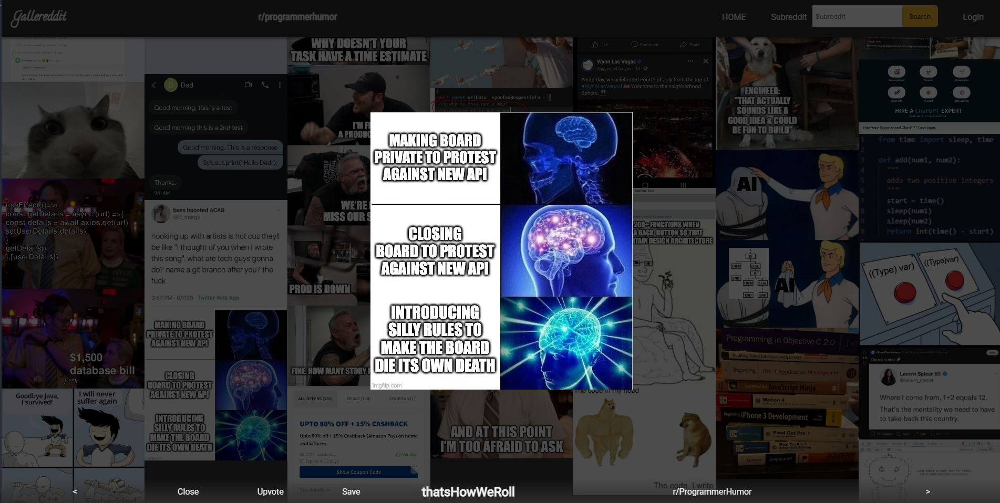

# Gallereddit (Reddit Gallery Visualizer) [Link](https://gallereddit.herokuapp.com/)

A small gallery Single Page Application (SPA) working with Reddit's API

Used to learn how to handle OAuth2, APIs and React Hooks.

## Features

1. Able to view all posts containing images pulled from reddit API (Hosted image albums are pulled from Imgur API as well)
2. Able to restrict posts based on subreddit
3. Able to login to reddit account (Uses reddit OAuth2)
4. Once logged in, able to upvote and save posts to user account
5. Written using React Hooks
6. Infinite scroll using Intersection Observer

# Preview




# Setup 

1. Clone

```
git clone https://github.com/tohhongxiang123/Gallereddit.git
```

2. Install dependencies

```
npm install
cd client
npm install
cd ..
```

3. Copy `.env.example` to `.env` and fill in details

4. Run locally

```
npm run dev
```

### Useful Links
1. [How to fetch data using react hooks](https://www.robinwieruch.de/react-hooks-fetch-data)
2. [React's hooks documentation](https://reactjs.org/docs/hooks-reference.html)
3. [Reddit API Documentation](https://www.reddit.com/dev/api/)
4. [Aborting axios requests](https://github.com/axios/axios/blob/master/README.md#cancellation)
5. [Hacky way to redirect users from the client side, based on server-side process.env variables](https://stackoverflow.com/questions/49835830/res-redirect-cors-not-working-in-mean-app)
6. [Imgur API Docs](https://apidocs.imgur.com/?version=latest#intro)

### To add
- Hover on image should show information
- Better responsive behavior for single post on mobile
- How to display disproportionate images (really tall/wide images)
- Sort by hot/top/controversial by time